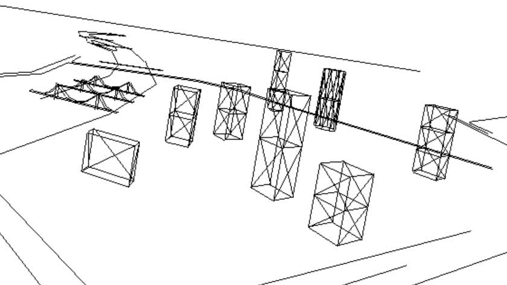

\[click on the image to start the simulator\]  
[](https://xyzzy.github.io/jsFlightSim)

# jsFlightSim

A flight simulator written in javascript.

Try the demonstration here: [https://xyzzy.github.io/jsFlightSim/](https://xyzzy.github.io/jsFlightSim)

### Welcome to the Wonderful World of (ported) obfuscated `C`

`jsFlightSim` was inspired by Carl Banks' 1998 IOCCC entry [https://blog.aerojockey.com/post/iocccsim](https://blog.aerojockey.com/post/iocccsim)

The code was created in May 2011 and was intended to test HTML animations in a pre-canvas era.
 
GIF images are created using [jsGifEncoder](https://xyzzy.github.io/jsGifEncoder/)

## Usage

Keyboard mappings are:

 - Arrows for movement
 - Page up/down for faster/slower
 - Home for re-center stick

## Manifest

There are 3 demos. Each has a status line including the time needed to create/display a frame.

 - [index.html](index.html)  
   The original using jsGifEncoder to create a GIF image and load it into an &lt;img&gt; element.

 - [jsFlightSim-canvas-draw.html](jsFlightSim-canvas-draw.html)  
   HTML5 canvas using jsGifEncoder and drawImage()

 - [jsFlightSim-canvas-pixel.html](jsFlightSim-canvas-pixel.html)  
   HTML5 canvas using createImageData()/putImageData

## Source code

Grab one of the tarballs at [https://github.com/xyzzy/jsFlightSim/releases](https://github.com/xyzzy/jsFlightSim/releases) or checkout the latest code:

```sh
  git clone https://github.com/xyzzy/jsFlightSim.git
```

## Versioning

This project adheres to [Semantic Versioning](http://semver.org/spec/v2.0.0.html). 
For the versions available, see the [tags on this repository](https://github.com/xyzzy/jsFlightSim/tags).

## License

This project is licensed under Affero GPLv3 - see the [LICENSE.txt](LICENSE.txt) file for details.
